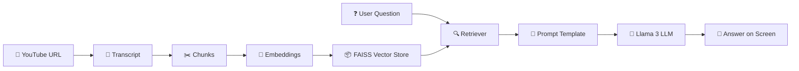
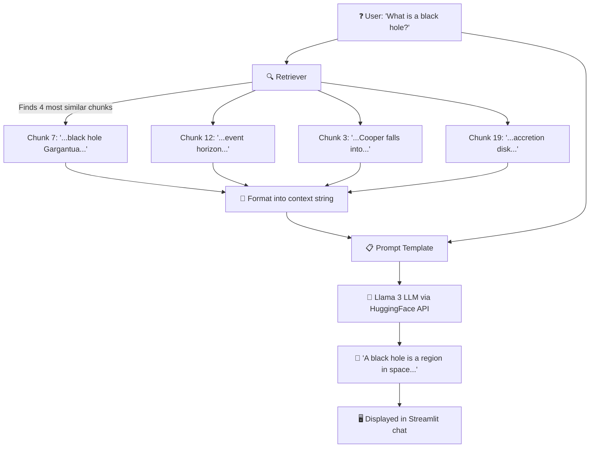
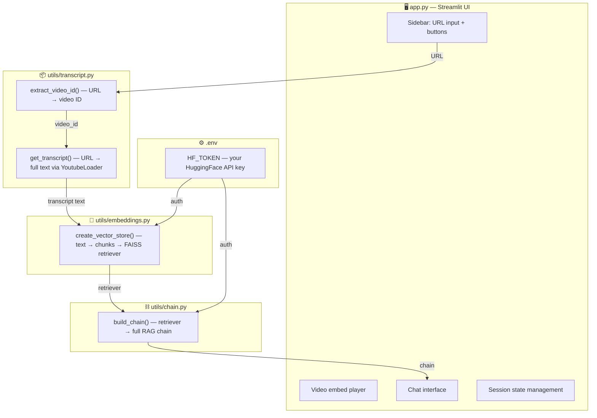

<div align="center">

# 🎬 YouTube Chatbot

### 🤖 Ask Anything About Any YouTube Video — Powered by AI

[](https://python.org)
[](https://langchain.com)
[](https://streamlit.io)
[](https://huggingface.co)
[](https://github.com/facebookresearch/faiss)
[](LICENSE)

*Paste a YouTube link, and chat with the video like you're talking to an expert who watched the whole thing.*

> 📅 **Last Updated:** July 2026

---

</div>

## 📌 About

**YouTube Chatbot** is an AI-powered tool that extracts the transcript from any YouTube video and lets you have a natural conversation about its content. Instead of watching a full video, simply paste the URL and ask questions — the bot provides detailed, context-aware answers based on what was said in the video.

Whether it's a 3-hour lecture, a tech tutorial, or a podcast episode — this chatbot has you covered.

> [!NOTE]
> This project uses a **RAG (Retrieval-Augmented Generation)** architecture — only the most relevant parts of the transcript are sent to the LLM, making it fast, cost-efficient, and accurate even for very long videos.

---

## ✨ Features

| Feature | Description |
|---|---|
| 🎥 **YouTube Transcript Extraction** | Automatically fetches the full transcript from any YouTube video via LangChain's `YoutubeLoader` |
| 💬 **Conversational Q&A** | Ask natural language questions and get detailed, accurate answers from the video content |
| 🧠 **AI-Powered Understanding** | Uses Meta Llama 3 (8B-Instruct) via HuggingFace Inference API for context-aware answers |
| 🔗 **RAG Pipeline** | Built with LangChain for retrieval-augmented generation — finds the most relevant transcript chunks before generating |
| 🖥️ **Premium Streamlit UI** | Dark-themed, animated web interface with glassmorphism design — just paste a link and start chatting |
| 📦 **FAISS Vector Store** | In-memory vector database for blazing-fast similarity search across transcript chunks |
| 🧮 **BGE Embeddings** | Uses BAAI/bge-large-en-v1.5 to convert text into 1024-dimensional meaning vectors |

---

## 🏗️ Architecture



There are **two phases** in this app:

| Phase | When | What Happens |
|---|---|---|
| **Phase 1: Video Processing** | User clicks "Load & Process Video" | URL → Transcript → Chunks → Embeddings → Vector Store |
| **Phase 2: Q&A Chat** | User types a question | Question → Retrieve relevant chunks → Build prompt → LLM generates answer |

---

## 🔬 Full Pipeline Deep Dive

<details>
<summary><b>📖 Phase 1 — Video Processing (click to expand)</b></summary>

### Step 1 — User Pastes a YouTube URL

The Streamlit sidebar has an input field. When the user clicks the **"🚀 Load & Process Video"** button, `app.py` kicks off the pipeline.

```
User pastes: https://www.youtube.com/watch?v=vXVRs_Sar6Y
                        ↓
           Clicks "🚀 Load & Process Video"
```

---

### Step 2 — Extract Video ID from URL

**File:** `utils/transcript.py` → `extract_video_id()`

```
Input:  "https://www.youtube.com/watch?v=vXVRs_Sar6Y&t=395s"
                        ↓
        Regex extracts the 11-char video ID
                        ↓
Output: "vXVRs_Sar6Y"
```

Uses regex patterns to handle all YouTube URL formats (`youtube.com/watch?v=`, `youtu.be/`, `/embed/`, `/v/`).

---

### Step 3 — Fetch the Transcript from YouTube

**File:** `utils/transcript.py` → `get_transcript()`

```
Video URL
        ↓
    LangChain YoutubeLoader fetches captions from YouTube
        ↓
    Returns the full transcript as one string
        ↓
Output: "Hello, friends! If you remember, in 2014, there was a blockbuster film..."
        (thousands of characters)
```

> [!NOTE]
> This only works for videos that have **captions/subtitles** enabled (auto-generated or manual).

---

### Step 4 — Split Transcript into Chunks

**File:** `utils/embeddings.py` → `create_vector_store()`

```
Full transcript (e.g. ~17,500 chars)
                ↓
    RecursiveCharacterTextSplitter
    chunk_size=1000, chunk_overlap=200
                ↓
┌──────────────────┐
│ Chunk 1 (1000ch) │  "Hello, friends! If you remember..."
├──────────────────┤
│   overlap 200ch  │  ← last 200 chars of Chunk 1
│ Chunk 2 (1000ch) │  "...was at the end of the film..."
├──────────────────┤
│   overlap 200ch  │
│ Chunk 3 (1000ch) │  "...of the spinning particles..."
├──────────────────┤
│      ...         │
│ Chunk N          │  (final chunk)
└──────────────────┘
```

> [!TIP]
> **Why chunk?** LLMs have token limits. We can't send the entire transcript. Instead, we find the *most relevant* chunks for each question. The **200-char overlap** ensures we don't cut sentences mid-thought.

---

### Step 5 — Generate Embeddings & Build Vector Store

**File:** `utils/embeddings.py` → `create_vector_store()`

```
N text chunks
        ↓
    HuggingFace Embedding Model (BAAI/bge-large-en-v1.5)
    Converts each chunk into a 1024-dimension number vector
        ↓
┌──────────────────────────────────────────┐
│ Chunk 1 → [0.023, -0.156, 0.891, ...]   │
│ Chunk 2 → [0.412, 0.067, -0.334, ...]   │
│ Chunk 3 → [-0.102, 0.445, 0.223, ...]   │
│ ...                                      │
│ Chunk N → [0.178, -0.089, 0.567, ...]   │
└──────────────────────────────────────────┘
        ↓
    Stored in FAISS (Facebook AI Similarity Search)
    = an in-memory vector database for fast lookups
        ↓
    Returns a "retriever" (search_type='similarity', k=4)
```

> [!IMPORTANT]
> **What is an embedding?** It converts text into numbers that capture *meaning*. Similar sentences produce similar numbers. This lets us do **"find text with similar meaning"** searches instead of exact keyword matching.

```
"black hole"     → [0.8, 0.2, ...]    }
"event horizon"  → [0.75, 0.25, ...]  } ← similar vectors (related topics)
"cooking recipe" → [-0.5, 0.9, ...]     ← very different vector
```

---

### Step 6 — Build the RAG Chain

**File:** `utils/chain.py` → `build_chain()`

```
Connects all the pieces together into ONE callable chain:

    retriever ──→ format_docs ──┐
                                ├──→ prompt ──→ Llama 3 LLM ──→ string output
    question (passthrough) ─────┘
```

This chain is saved in `st.session_state.chain` so it persists across user interactions.

</details>

<details>
<summary><b>💬 Phase 2 — Answering Questions (click to expand)</b></summary>



### Step 7 — User Types a Question

User types in Streamlit's `chat_input`: **"What is a black hole?"**

---

### Step 8 — Retrieve Relevant Chunks (Similarity Search)

The retriever converts the question to an embedding vector and finds the **4 closest chunks** in the FAISS vector store using cosine similarity:

```
Question embedding: [0.78, 0.19, ...]
                        ↓
    FAISS compares against all chunk embeddings
    using cosine similarity
                        ↓
    Returns top 4 most similar chunks:
    ✅ Chunk 7  (similarity: 0.92) — talks about black hole Gargantua
    ✅ Chunk 12 (similarity: 0.87) — talks about event horizon
    ✅ Chunk 3  (similarity: 0.84) — Cooper falling into black hole
    ✅ Chunk 19 (similarity: 0.81) — accretion disk description
```

---

### Step 9 — Build the Final Prompt

The 4 retrieved chunks are joined and inserted into the prompt template:

```
┌─────────────────────────────────────────────────────────────┐
│ You are a helpful assistant that answers questions based on │
│ YouTube video transcripts.                                  │
│ Answer only from the provided transcript context.           │
│                                                             │
│ Context from the video transcript:                          │
│ [Chunk 7 text]                                              │
│ [Chunk 12 text]                                             │
│ [Chunk 3 text]                                              │
│ [Chunk 19 text]                                             │
│                                                             │
│ Question: What is a black hole?                             │
│                                                             │
│ Answer:                                                     │
└─────────────────────────────────────────────────────────────┘
```

---

### Step 10 — LLM Generates the Answer

```
Final prompt
      ↓
  Sent to HuggingFace Inference API
  Model: meta-llama/Meta-Llama-3-8B-Instruct
  (runs on HuggingFace's servers, NOT on your PC)
      ↓
  LLM reads the context + question
  Generates a natural language answer
      ↓
  StrOutputParser extracts just the text string
      ↓
Output: "According to the video, a black hole is a region
        in space where gravity is so strong that nothing,
        not even light, can escape from it..."
```

---

### Step 11 — Display on Screen

```
Answer string
      ↓
  st.chat_message("assistant") displays it as a chat bubble
      ↓
  Saved to st.session_state.messages (chat history)
      ↓
  User sees the answer in the Streamlit UI with 🤖 avatar
```

</details>

---

## 📐 File-by-File Responsibility Map



---

## 🧩 Why RAG?

This app uses **RAG — Retrieval-Augmented Generation**:

| Without RAG | With RAG (this app) |
|---|---|
| Send entire transcript to LLM | Send only relevant chunks |
| ❌ Hits token limits on long videos | ✅ Works with any length video |
| ❌ LLM gets confused with too much text | ✅ Focused, accurate answers |
| ❌ Expensive (more tokens = more cost) | ✅ Cheaper (fewer tokens sent) |

```
RAG = "Don't send everything. Search first, then send only what's relevant."
```

---

## 🚀 Getting Started

### Prerequisites

- **Python 3.9+** installed on your machine
- A **HuggingFace API Token** — get one free at [huggingface.co/settings/tokens](https://huggingface.co/settings/tokens)
- **pip** package manager

### 🔧 First-Time Setup

Open a terminal in the project folder and run these commands **one by one**:

1. **Clone the repository**
   ```bash
   git clone https://github.com/tiwariankit1708/Youtube_Chatbot.git
   cd Youtube_Chatbot
   ```

2. **Create a virtual environment**
   ```bash
   python -m venv venv
   ```

3. **Activate the virtual environment**

   **Windows (PowerShell):**
   ```powershell
   .\venv\Scripts\activate
   ```
   **Windows (CMD):**
   ```cmd
   venv\Scripts\activate.bat
   ```
   **macOS / Linux:**
   ```bash
   source venv/bin/activate
   ```

   > ✅ You'll see `(venv)` appear at the start of your terminal prompt when activated.

4. **Install all dependencies**
   ```bash
   pip install -r requirements.txt
   ```

5. **Set up your API key**

   Create or edit the `.env` file in the project root:
   ```env
   HF_TOKEN=your_huggingface_api_token_here
   ```
   > 💡 Get your free token at: https://huggingface.co/settings/tokens

6. **Run the application**
   ```bash
   streamlit run app.py
   ```

7. **Open your browser** and go to `http://localhost:8501`

---

### 🔄 Returning to the Project (Next Time)

Already set up? Just run these **2 commands**:

**Windows (PowerShell):**
```powershell
.\venv\Scripts\activate
streamlit run app.py
```

**Windows (CMD):**
```cmd
venv\Scripts\activate.bat
streamlit run app.py
```

**macOS / Linux:**
```bash
source venv/bin/activate
streamlit run app.py
```

> ⚠️ Always activate the virtual environment **before** running the app, otherwise Python won't find the installed libraries.

---

## 📖 Usage

1. **Paste a YouTube URL** into the sidebar input field
2. **Click** "🚀 Load & Process Video" and wait for processing
3. **Ask any question** about the video in the chat input
4. **Get detailed answers** — follow up with more questions as needed!

### 💡 Example Questions You Can Ask

> *"What are the main points discussed in this video?"*
>
> *"Explain the concept mentioned at the beginning of the video."*
>
> *"Summarize this video in 5 bullet points."*
>
> *"What solution did the speaker suggest for the problem?"*
>
> *"Can you explain the technical details discussed around the middle of the video?"*

---

## 🛠️ Tech Stack

| Technology | Purpose |
|---|---|
| **Python 3.9+** | Core programming language |
| **Streamlit** | Web application framework with custom dark theme |
| **LangChain** | LLM orchestration, prompt templates, and RAG chain assembly |
| **Meta Llama 3 (8B-Instruct)** | Large Language Model via HuggingFace Inference API |
| **BAAI/bge-large-en-v1.5** | HuggingFace embedding model (1024-dim vectors) |
| **FAISS** | Facebook AI Similarity Search for vector retrieval |
| **LangChain YoutubeLoader** | Transcript extraction from YouTube videos |
| **python-dotenv** | Environment variable management |

---

## 📁 Project Structure

```
Youtube_Chatbot/
├── app.py                  # Main Streamlit application (UI, session state, chat)
├── requirements.txt        # Python dependencies
├── youtube_chatbot.ipynb   # Jupyter notebook (development / experimentation)
├── .env                    # Environment variables (HF_TOKEN)
├── .gitignore              # Git ignore rules
├── README.md               # This file
└── utils/                  # Utility modules
    ├── __init__.py          # Package initializer
    ├── transcript.py        # YouTube URL parsing & transcript extraction
    ├── embeddings.py        # Text chunking, BGE embeddings & FAISS vector store
    └── chain.py             # LangChain RAG chain assembly (LLM + prompt + retriever)
```

---

## 🤝 Contributing

Contributions are welcome! Here's how you can help:

1. **Fork** the repository
2. **Create** a feature branch (`git checkout -b feature/amazing-feature`)
3. **Commit** your changes (`git commit -m 'Add amazing feature'`)
4. **Push** to the branch (`git push origin feature/amazing-feature`)
5. **Open** a Pull Request

---

## ⚠️ Limitations

- Only works with YouTube videos that have **transcripts/subtitles** available
- Accuracy depends on the **quality of the transcript** (auto-generated captions may have errors)
- Very long videos may take **longer to process** due to transcript size and embedding generation
- Requires an **active internet connection** and a valid HuggingFace API key
- The LLM runs on HuggingFace's servers — response times depend on their availability

---

## 📜 License

This project is licensed under the **MIT License** — see the [LICENSE](LICENSE) file for details.

---

## 🙋‍♂️ Author

**Ankit Tiwari**

- GitHub: [@tiwariankit1708](https://github.com/tiwariankit1708)

---

<div align="center">

### ⭐ If you found this project useful, give it a star!

*Built with ❤️ and AI*

</div>
